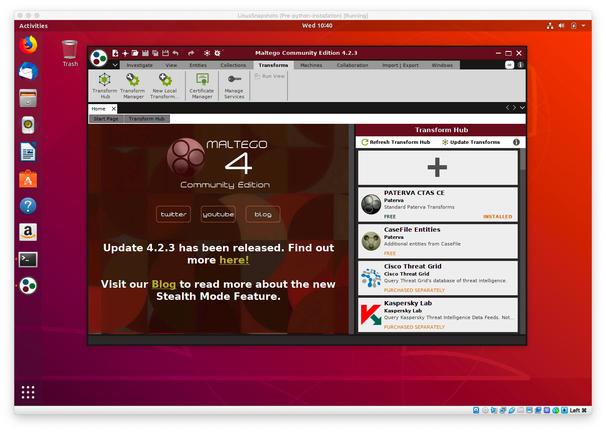
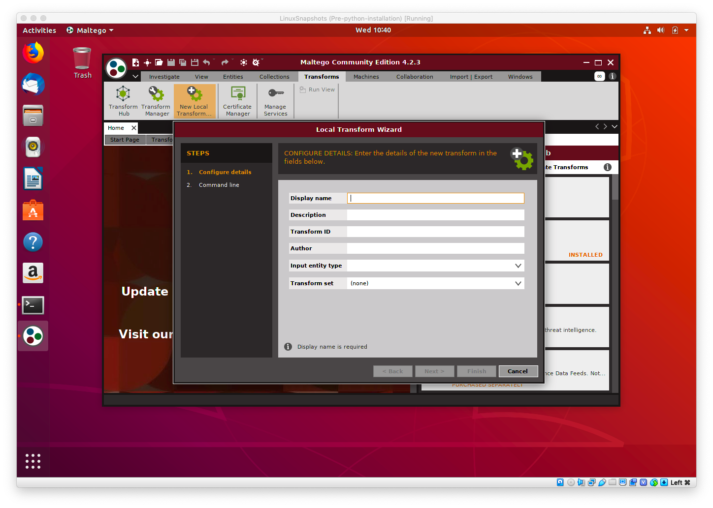
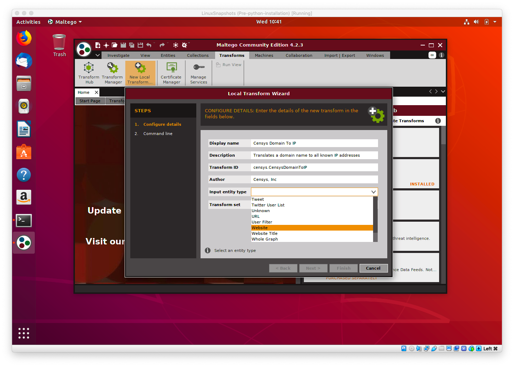
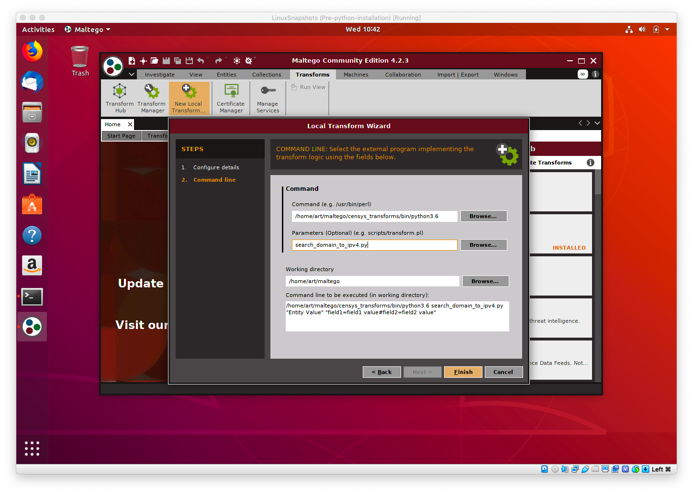
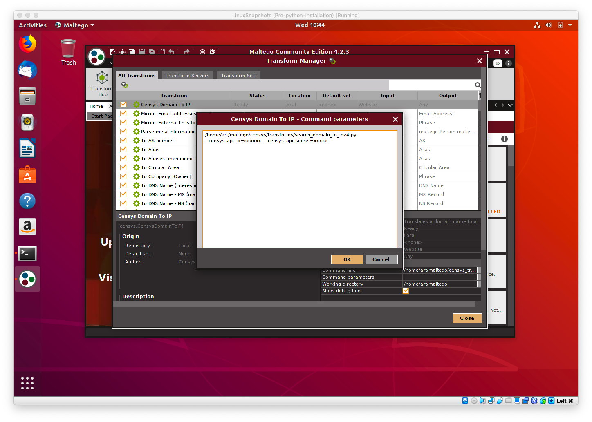
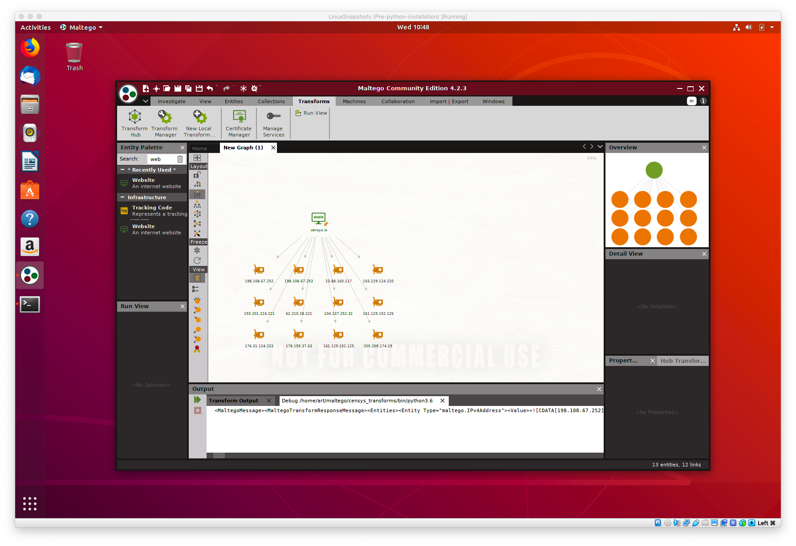

### Configuring Censys Plugins with Maltego

This document assumes you have successfully installed Maltego and Python3. It also makes the assumption that you've cloned
the repository to your computer already. If you need help with installation, [please follow this doc](INSTALL.md)

If you're ready to configure your new Censys transforms, open up Maltego, and follow the guide below.

#### Configuration
The first transform we'll configure will be the Censys Domain to IPv4 transform.

1. Open Maltego and navigate to the "transforms" tab.

1. Click "New Local Transform" to open the "Transform Wizard"

1. Fill out the Details like below. For the "Input Entity Type" select either, `Website` or `Domain`. If you would like
to translate from both, simple repeat these steps and select, `Domain` instead of `Website`. `Do not select a Transform set right now`

1. In the next step, you'll provide the actual details need for the transform to run. In the example below, We've selected 
`python3` from our virtualenv path and set the working directory to be the root of the project. In this case, `/home/art/maltego`.
Depending on where you cloned the directory, it could be different. For example, using the default name from the git clone command,
the project directory would be `/home/art/censys-maltego` in this case.

1. The `Paramters` field will eventually hold the name of the script and any command line flags you'd like to use. We'll configure our
api too, but in a later step. For now, we can leave this blank. We'll reconfigure it in later steps.

1. Once you've clicked the `Finish` button, you'll be taken back to the Transforms screen. Click the "Transform Manager"
button at the top and find your new transform plugin! We'll finish our configuration. Maltego does have a nice feature that
allows for bulk editing transform details. So, for example, you could update the python version or location or update the 
working directory if the system path ever changes. For now, let's focus on the `command parameters` field. Click the `...` button
next to the text field to open the modal box.
Paste in the full path to the transform script and make sure you add the Censys API credentials. 

1. Once these steps are complete, you'll have a fully functional transform! Just repeat the steps in this document for each
transform you'd like to use. 
