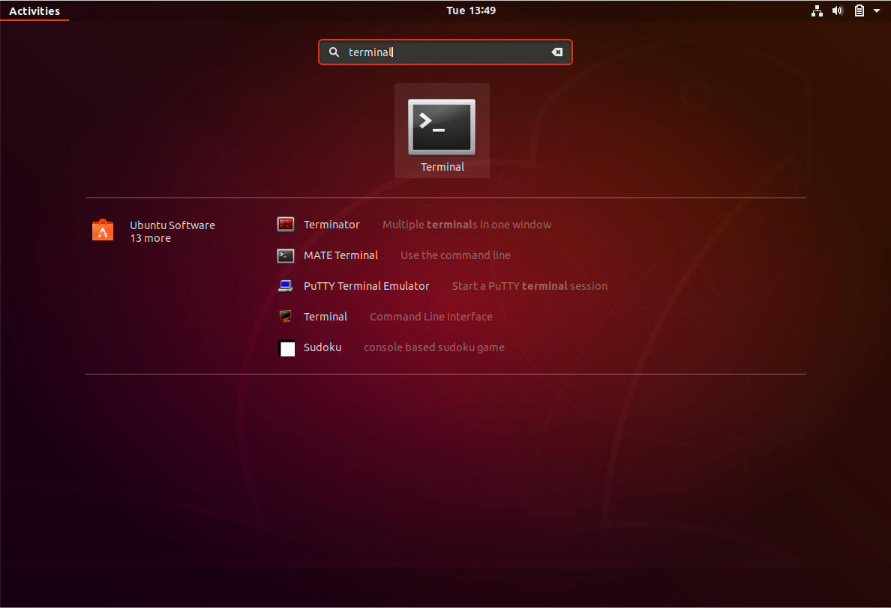
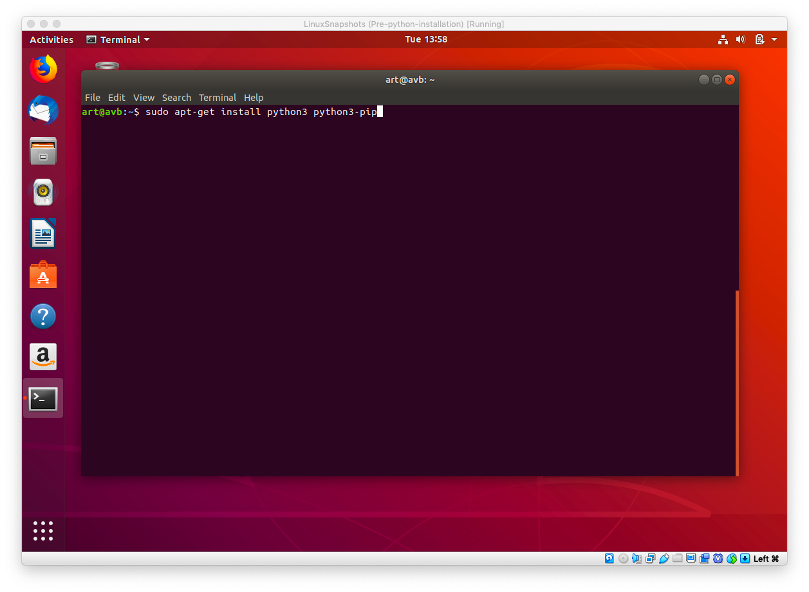
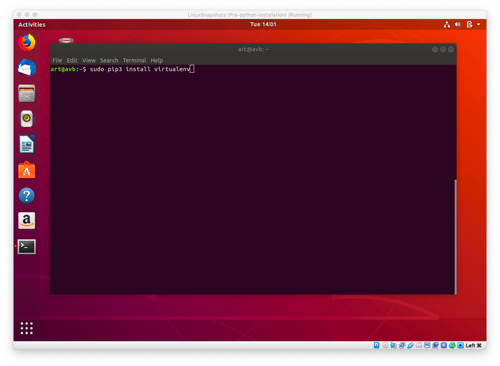
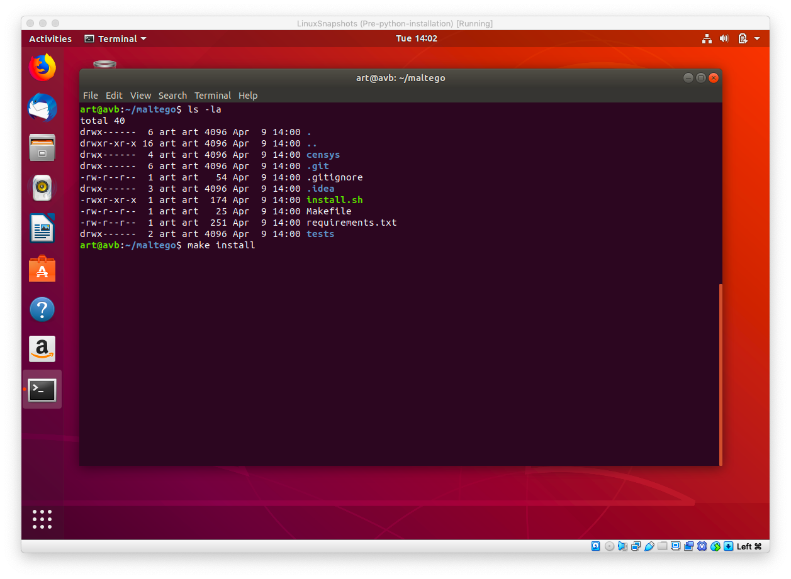

##### We strongly encourage the use of a python virtual environment

Instructions are written for MacOS and Linux Operating Systems.

For configuration help, please review the [configuration doc](CONFIG.md)

- Open the command line! (This is how you know fun is about to begin!)

 - Make sure you have your API key and API Secret handy!

### Setup
1. Make sure python3 and pip3 are installed

1. Make sure virtualenv is installed

1. Clone the repository from Github [Censys-Maltego](https://github.com/censys/censys-maltego.git)
  `git clone https://github.com/censys/censys-maltego.git`
1. `cd censys-maltego`
1. `make install`
